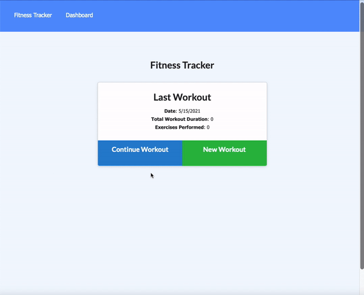

# Fit Tracker

## Description 

This is a way for a user to track their workouts and duration so that they know what they've done already. 

## Table of Contents

* [Installation](#installation)
* [Usage & Testing](#usage)
* [Contact](#contact)

## Installation
1. [Clone Repository](https://github.com/moagermo/FitTracker)

2. Install packages
    * Uses the [NodeJS](https://nodejs.org/en/).
    * Uses the [MongoDB](https://www.mongodb.com)
    
    
3. Open Terminal

4. npm install required dependencies

5. Start app with "npm start"

## Usage

When you start the app you'll be greeted with any previous workout you had submitted - if none, you'll have the option to add a new exercise. If you have previous workouts, you'll be able to continue the previous, or add a new one.

**New Workout**
To give a new workout, you will need to choose resistance or cardio and then fill in the form with your workout information (reps, duration etc.) 

## Contact

Email: [moager@att.net](mailto:moager@att.net)
Phone: [614-969-9988](tel:6149699988)
GitHub: [Mo's GitHub](https://github.com/moagermo)
